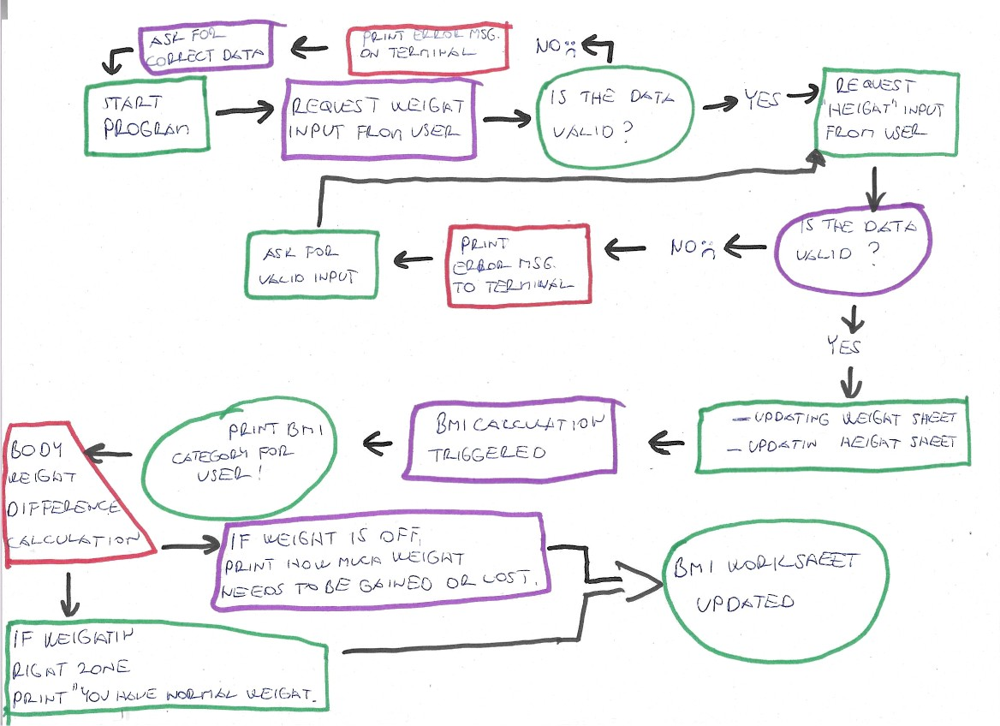

# BMI Calculator: a body mass index calculation app

'BMI Calculator' is a command-line-interface (CLI) health app hosted as an app on Heroku, written in Python.

## Purpose 
The objective of this app is to provide the user with a guidence to reach and maintain healthy body weight. Through calculation of
body mass index, the application will update the user about the current body weight range and let's the user track the changes over 
time.

## Requirement Gathering and Planning

Before starting the coding for this project, I took the time to think about how to set up the architecture of this app, the layout of the output on the console and the functionality required to provide a good user experience. As the CI study material advised, I kept it simple,
and I tried to follow a 'linear' logic.

## User Demographics, Stories and Needs

### Target Demographic
This app is useful for anyone wanting to track and control their body mass index and through that, their health.
Abnormal bodyweight is linked with several illness and disases, when one decides to make change for the better, the use of this application
could be the first step towards a healthier lifestyle.

 Some examples of such people are: 

- Family hiatory: people who's family has a history of diabetes, heart disease, obesity.
- Sendentary lifestyle: People at full time work and with familiy duties who won't have time for their own activities, always low
on energy. 
- Eating disorder/ body image issues: people who are follow extreme diets, trends, pursuing the lowest possible body weight.

### User Stories

|As a body mass index calculator user, I want to... | So that... |
|--------|--------|
| ...check my body mass index. | ...I will have an indicator of my generic health. |
| ...know that in what weight category do I fall. | ...I would know if I have to gain, maintain or lose weight.|
| ...receive specific information with regards of my weight. | ...I will have a clear number to gain or lose. |
| ...I want to save my calculation. | ...I can start tracking my weight change, bmi change over time. |
| ...to be able to re-do the calculation. | ...in case any of my details were not accurate, I could repeat the calculation. |
| ...to be able to delete my last calculation, results. | ...noone else could access my details, or I just want to repeat it at a different time. |
| ...have a clear and intuitive method of navigating through the app via the command line. | ...I can easily navigate and use the app. |

## Technologies Used

### Language Used

+ Python

### Frameworks, Libraries & Programs Used

1. Google Sheet: 
+ Google sheet was used to connect with the app in order to store data on a spreadsheet.

2. Google Cloud Platform
- to set up API's.

3. Google Sheets API

4. Google Drive API

5. GitHub
- Github was used to store the project after being pushed

6. VS Code Editor
- To write and run the code VS Code editor was used which is Code Institute's cloud based IDE platform.

